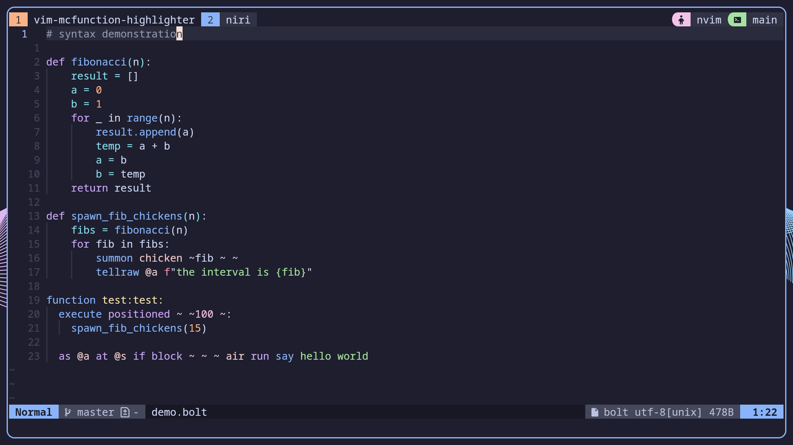

> **Vibecoded.** This is a fork of [RubixTheSlime/vim-mcfunction](https://github.com/RubixTheSlime/vim-mcfunction)
> with bolt support added on top, written by an LLM

# vim-bolt-highlight
A syntax highlighter for mcfunction (Minecraft datapack functions) and
[Bolt](https://github.com/mcbeet/bolt) (hybrid mcfunction + Python) in vim.
Beyond simple keyword highlighting, it aims to surface exactly how the game
will interpret each command to reduce development time.



## Installation

<details>
<summary><b>vim.pack</b> (Neovim 0.12+ built-in)</summary>

```lua
vim.pack.add({
  'https://github.com/rubixninja314/vim-mcfunction-highlighter',
})
```
</details>

<details>
<summary><b>lazy.nvim</b></summary>

```lua
{
  "amqndin/vim-bolt-highlight", opts = {}
}
```
</details>

## Bolt Support

This plugin also provides syntax highlighting for [Bolt](https://github.com/mcbeet/bolt), a hybrid mcfunction + Python language.

`.bolt` files are detected automatically. All mcfunction highlighting works in Bolt files, plus:

- **Python keywords**: `def`, `class`, `from`, `import`, `return`, `yield`, `raise`, `pass`, `break`, `continue`, `global`, `nonlocal`
- **Python builtins**: `print`, `len`, `range`, `int`, `str`, `float`, `list`, `dict`, `set`, `tuple`, and more
- **Python strings**: single/double quoted, raw (`r"..."`) and f-string (`f"..."`) variants, triple-quoted (`"""..."""`)
- **Python constants**: `True`, `False`, `None`, `true`, `false` (YAML booleans)
- **Decorators**: `@decorator` syntax
- **`raw` command**: verbatim escape hatch (`raw setblock ~ ~ ~ stone`)
- **Bolt keywords**: `macro`, `memo`, `@defer`, `require`
- **Resource modifiers**: `append`, `prepend`, `merge`
- **Resource keywords**: `function`, `function_tag`, `block_tag`, `item_tag`, `entity_tag`, `loot_table`, `predicate`
- **`command = "..."`** macro parameter syntax
- **`$(...)` and `${...}`** interpolation
- **Relative paths**: `./`, `~/` path prefixes
- **Implicit execute**: `as`, `at`, `if`, `unless`, `positioned`, `rotated`, `anchored`, `align`, `facing`, `in`, `store`, `run`, `expand` at line start
- **Unpacking operators**: `*list`, `**dict`
- **YAML blocks**: key: value pairs and `- ` list items in indented blocks
- **Variable assignment**: top-level `name = value`

## Final Notes / Warnings

As of right now, sounds (used by `/playsound` and `/stopsound`) and recipes (used by `/recipe`) are not fully implemented.
Specifically, some sounds that were not available in older snapshots may still highlight as a false-positive, and only the recipes that happen to share a name with an item will highlight.
The multiplayer commands may or may not work. To my knowledge they highlight correctly, but I am not sure if they'll actually run.

If you notice any discrepancies, please feel free to submit an issue.

There may be some features that are not fully implemented, as of this point the main goal with this project is to begin keeping it up to date with current Minecraft versions.
